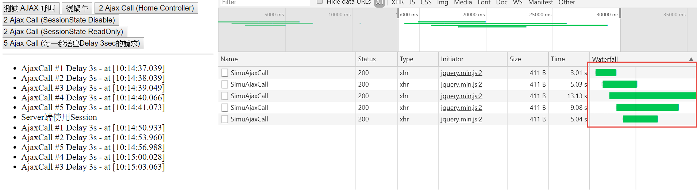
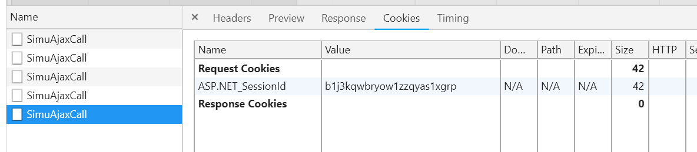
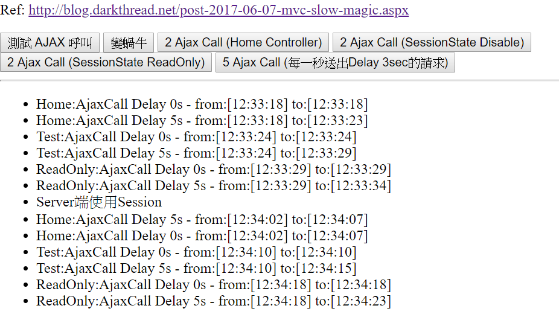
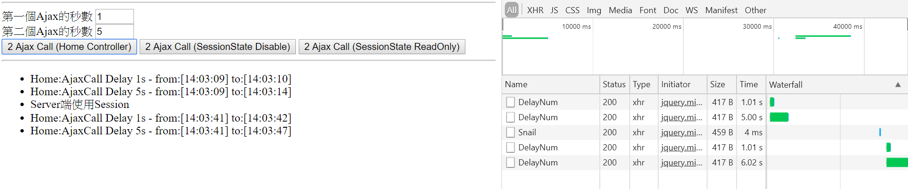
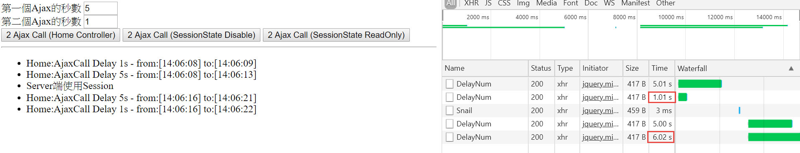

# 實際測試

開啟網站 http://localhost:6090/MultiAjaxDelay/index.html

本次測試主要針對後端接收請求所發生的阻塞現象，情境為僅有少數的連線請求；大量連線請求受限於瀏覽器本身。

## 正常情況 (未使用到 Session)

實際測試各種情境，大致上所發出的 ajax 請求會受到瀏覽器的限制，IE 可以透過修改機碼變更瀏覽器的同時請求連線數量。

## 異常情況 (使用到 Session)

當後端程式有使用到 `session`，導致前端後續發出的 `ajax` 請求也會帶上 `request cookie`。



後端模擬接收到請求之後 delay 3 秒鐘，前端每隔 1 秒送一次請求。

在比對本次測試的情境，一個 ajax 正常執行；另外一個後端處理先睡 5 秒在回應，看看兩個 ajax 是否會一起將結果拋回前端。測試結果如下


可以看到在 Home Controller 的部分，已經有 session 的情況下，送出請求將會出現同時回應的情況。

而 Test Controller 與 ReadOnly Controller 的情況下，分別設置了

```
[SessionState(SessionStateBehavior.Disabled)]
```

```
[SessionState(SessionStateBehavior.ReadOnly)]
```

執行結果就正常

---

改寫測試程式，若兩個 ajax 一個執行很快，一個很久。比較難以看出問題，測試情境改為
一個 ajax 為 1 秒執行完畢；另外一個 ajax 為 5 秒執行完畢

| Session Exists ? | Ajax (1s) | Ajax (5s) | 說明                                                                                                                         |
| ---------------- | --------- | --------- | ---------------------------------------------------------------------------------------------------------------------------- |
| No               | 1s        | 5s        | 各自發出請求，時間到各自回應，無須互相等待                                                                                   |
| Yes              | 1s        | 6s        | 同時發出請求，但是後面要等前面的執行時間 <span style="color:red">1</span> 秒，所以一共是 <span style="color:red">6</span> 秒 |



| Session Exists ? | Ajax (5s) | Ajax (1s) | 說明                                                                                                                         |
| ---------------- | --------- | --------- | ---------------------------------------------------------------------------------------------------------------------------- |
| No               | 5s        | 1s        | 各自發出請求，時間到各自回應，無須互相等待                                                                                   |
| Yes              | 5s        | 6s        | 同時發出請求，但是後面要等前面的執行時間 <span style="color:red">5</span> 秒，所以一共是 <span style="color:red">6</span> 秒 |



# 結論

同時發出多個 ajax 請求，若沒有 session 影響，各請求會各自獨立開來。
若有 session 影響，則伺服器一次只能處理一個請求，這會造成後面的請求被延遲執行。
